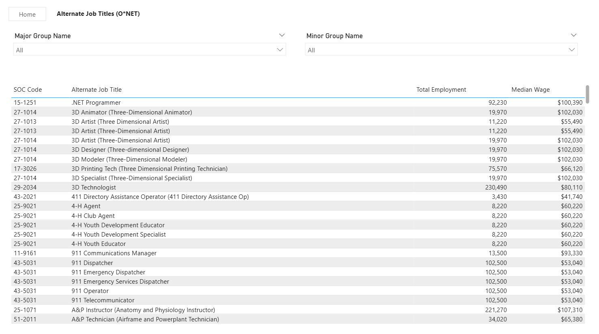
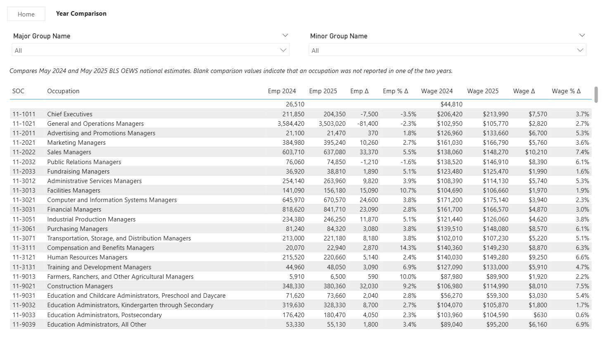
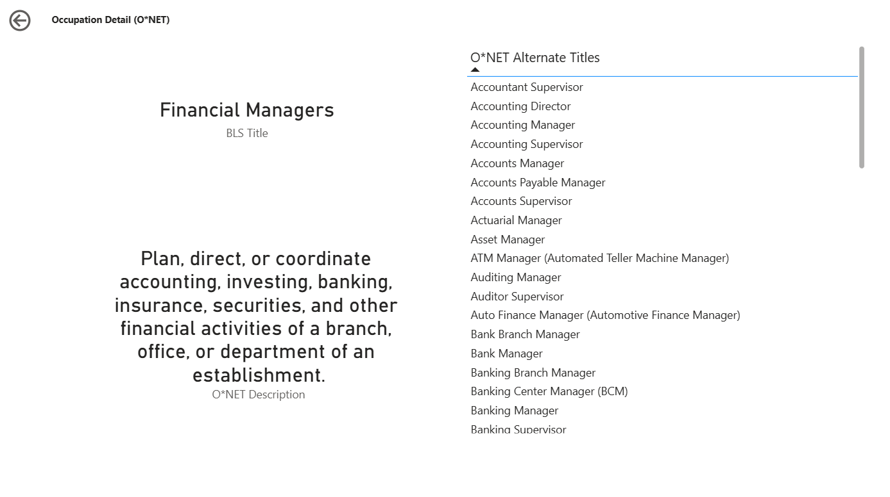

# Risk Mirror

Risk Mirror is a Power BI analytical reference that combines public BLS Occupational Employment and Wage Statistics (OEWS) with O*NET occupation descriptions and job titles through the Standard Occupational Classification (SOC) framework.

## Purpose

Risk Mirror is intended as an analytical reference for exploring occupations, employment, wages, and occupational terminology using trusted public datasets. It is designed to provide objective labor market context that can support workforce planning, compensation benchmarking, and related analytical decisions.

## Features

- Explore national employment and wage data for detailed U.S. occupations.
- Browse occupations within the Standard Occupational Classification (SOC) hierarchy.
- View O*NET occupation descriptions alongside BLS labor market information.
- Discover alternate job titles associated with each occupation.
- Compare employment and wage measures across 2024 and 2025 OEWS releases.
- Drill through to detailed occupation reference pages.

## Current Data

The current release incorporates the following public datasets:

- Bureau of Labor Statistics (BLS) Occupational Employment and Wage Statistics (OEWS): May 2025 National Estimates
- O*NET Database: Version 30.3
- Standard Occupational Classification (SOC): 2018 Structure

## Built With

- Microsoft Power BI
- Power Query
- Tabular Editor

## Version 2.0

- Updated to May 2025 BLS OEWS National Estimates
- Updated to O*NET Database Version 30.3
- Added Year Comparison page with 2024–2025 employment and wage analysis
- Introduced support for multi-year OEWS comparisons.

## Repository Contents

- Power BI report (.pbix)
- Semantic model (.bim)
- Documentation
- Version notes

## Notes

This project uses only publicly available datasets and is intended for informational and analytical reference purposes.

## Screenshots

### Cover Page

*Landing page providing navigation to the primary report views.*

---

### BLS Labor Market View

*National OEWS employment and wage data organized by the Standard Occupational Classification (SOC) framework.*

---

### Occupation Meaning	

*O*NET occupation descriptions presented alongside BLS labor market information for additional occupational context.*

---

### Alternate Job Titles

*O*NET alternate job titles associated with each SOC occupation.*

---

### Year Comparison

*Side-by-side comparison of employment and wage measures across the 2024 and 2025 OEWS releases.*

---

### Occupation Detail

*Detailed reference page combining occupation title, O*NET description, and associated job titles for a selected occupation.*