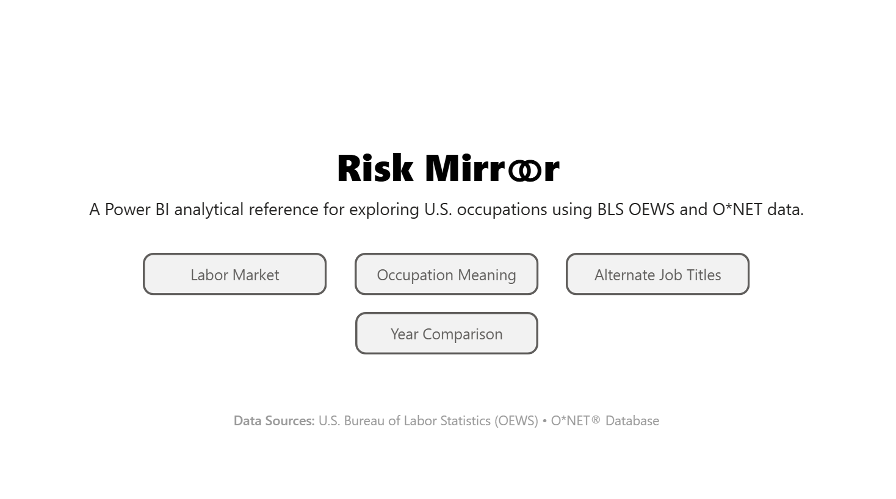
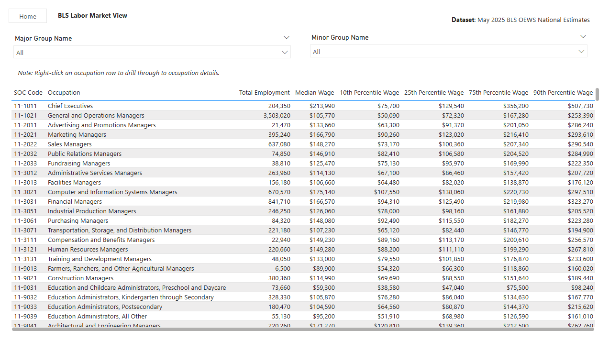
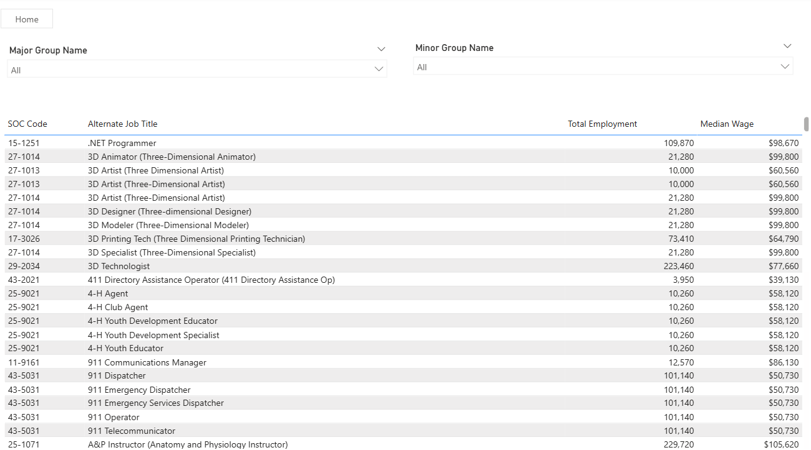
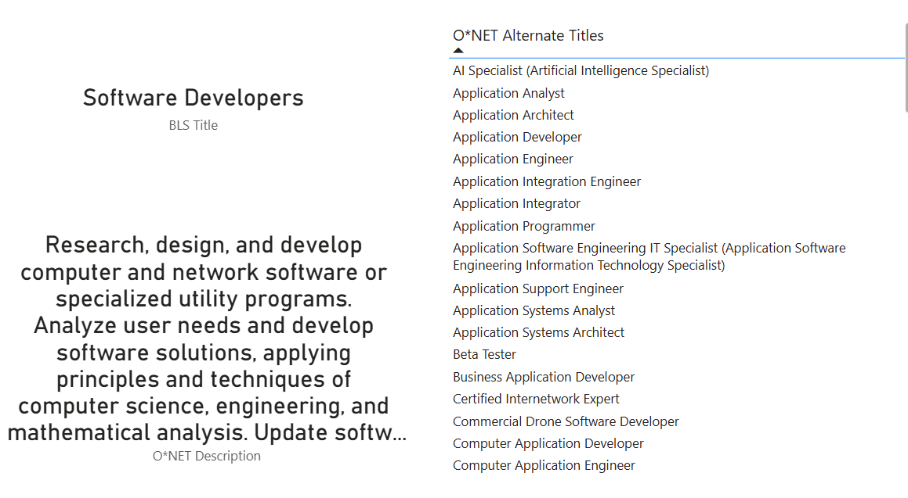

# Risk Mirror

Risk Mirror is a Power BI reference tool that connects public BLS OEWS labor market data with O*NET occupation descriptions and alternate job titles through SOC codes.

## Purpose

Risk Mirror is intended as a lightweight analytical reference tool for exploring occupations, wages, employment, and occupational terminology using public datasets.

## Data Sources

- BLS OEWS
- O*NET Occupation Data
- O*NET Alternate Titles

## Built With

- Microsoft Power BI
- Power Query

## Notes

This project uses only public datasets and is intended for informational and analytical reference purposes.

## Screenshots

### Cover Page

*Risk Mirror opening page with simple navigation into the core report views.*

---

### BLS Labor Market View

*Complete SOC-anchored BLS OEWS labor market reference table showing employment and wage percentile data.*

---

### Occupation Meaning

*ONET occupation descriptions joined to BLS employment and wage measures for interpretive context.*

---

### Alternate Job Titles

*ONET alternate job titles mapped back to SOC occupations and BLS labor market measures.*

---

### Occupation Detail Drillthrough

*Drillthrough detail page combining occupation title, ONET description, and alternate titles for a selected SOC occupation.*
